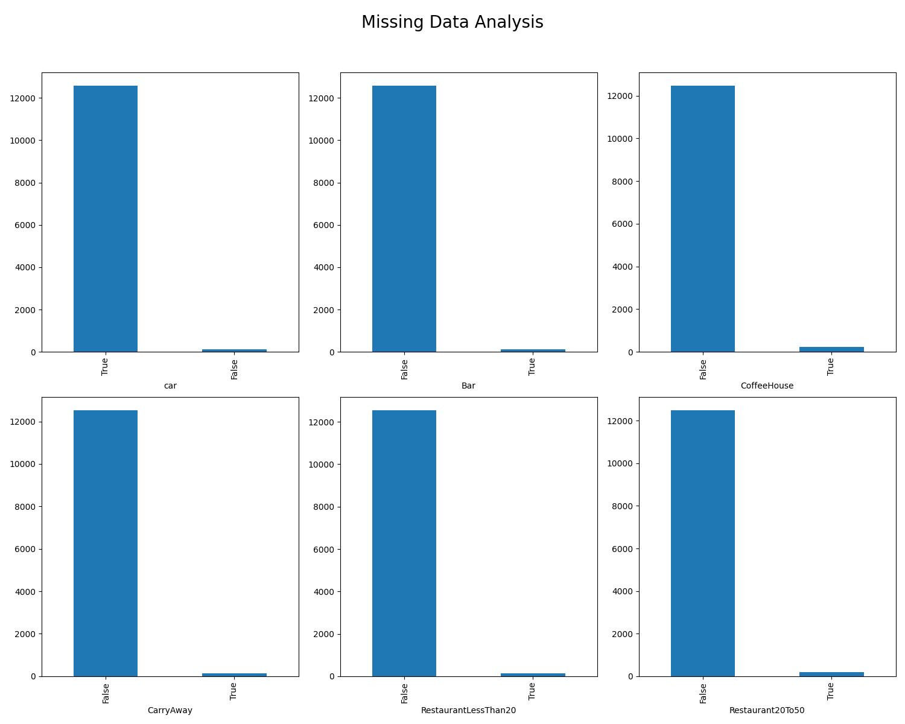

# Assignment 5.1: Will the Customer Accept the Coupon?

## Overview

This project explores factors that influence whether a customer accepts a driving coupon. The analysis uses data from
the UCI Machine Learning repository, collected via a survey on Amazon Mechanical Turk. The goal is to distinguish
between customers who accepted a driving coupon versus those who did not, using visualizations and probability
distributions.

## Data

The dataset includes attributes such as user demographics, contextual attributes (e.g., weather, time, destination), and
coupon attributes. The data is stored in a CSV file and analyzed in a Jupyter Notebook.

## Files

- [coupons.csv](data/coupons.csv): The dataset used for the analysis.
- [prompt.ipynb](prompt.ipynb): The Jupyter Notebook containing the analysis and visualizations.

## Instructions

1. Clone this repository.
2. Open `prompt.ipynb` in Jupyter Notebook or any compatible IDE.
3. Run the cells to explore the dataset and visualize the results.

## License

This project uses data from the UCI Machine Learning repository.

## Analysis

Original dataset has 12684 rows with 26 columns.

### Missing Data Analysis

| Column               | % Null Data |    
|----------------------|-------------|
| car                  | 99.15%      |           
| Bar                  | 0.84%       |           
| CoffeeHouse          | 1.71%       |           
| CarryAway            | 1.19%       |
| RestaurantLessThan20 | 1.02%       |
| Restaurant20To50     | 1.49%       |

- **99%** of the data in the column 'car' is null. We can drop this column as it does not provide any useful information for
our analysis.
- Also, we can drop the rows with null values in the other columns ['Bar', 'CoffeeHouse', 'CarryAway', 'RestaurantLessThan20', 'Restaurant20To50'] as they are not significant in number ( ~1% of the data).

Data shape after removing missing data columns/rows: **(12079, 25)**

### Proportion of Total Observations that Accepted the Coupon

- **Proportion of acceptance:** 56.93%

### Bar Coupon Analysis

1. **Proportion of bar coupons accepted:** 41.23%
2. **Acceptance rate comparison:**
    - Drivers who went to a bar 3 or fewer times a month: 37.27%
    - Drivers who went to a bar more than 3 times a month: 76.17%
3. **Drivers who go to a bar more than once a month and are over 25:** 68.98%
4. **Drivers who go to bars more than once a month, had passengers that were not kids, and had occupations other than
   farming, fishing, or forestry:** 70.94%
5. **Acceptance rates for specific groups:**
    - Drivers who go to bars more than once a month, had passengers that were not kids, and were not widowed: 70.94%
    - Drivers who go to bars more than once a month and are under 30: 71.95%
    - Drivers who go to cheap restaurants more than 4 times a month and have an income less than $50K: 45.65%

### Hypothesis

- Drivers who go to bars more than once a month and are under the age of 30 are more likely to accept the coupon than
  those who are older than 30.
- Marital status and occupation do not significantly impact the acceptance rate for drivers who go to bars more than
  once a month.
- Acceptance rate decreases for drivers who are older than 30 and go to bars more than once a month.

### Coffee House Coupon Analysis
1. **Proportion of Coffee House coupons accepted:** 49.63%
2. **Acceptance rate comparison:**
   - who go to coffee houses more than once a month, had passengers that were not a kid, and were not widowed	: 65.97%
   - who go to coffee houses more than once a month and are under the age of 30					: 68.60%
   - who go to cheap restaurants more than 4 times a month and income is less than 50K				: 54.70%
3.  **Acceptance rates for specific groups:**
  - who had passengers that were friends							: 59.74%
  - temperature < 40									: 44.15%
  - who go to coffee houses more than once a month and had passengers that were friends				: 77.78%
  - who go to coffee houses more than once a month and had passengers that were friends and temperature < 40	: 71.43%

### Hypothesis
- Coffee House coupon acceptance results are interesting. the acceptance and rejection ratio is almost 50-50% (49.63% vs 50.36%)
- Coupon acceptance rate drops significantly when the temperatures are below 40.
- Acceptance rate is significantly high with frequent coffee shop visitors who have friends as passengers. But the same group has a little lower acceptance rate when the temperature is less than 40.
- marital status doesn't have an impact on coupon acceptance rate but the lower age has slightly increases the acceptance rate.

### Next Steps
- Generally Coffee House coupon acceptance should increase when the temperatures are low but the data suggests otherwise. It could be an anomaly with the data or lower temperatures might be impacting the mobility. Further analysis considering driving distance may explain this anomaly.